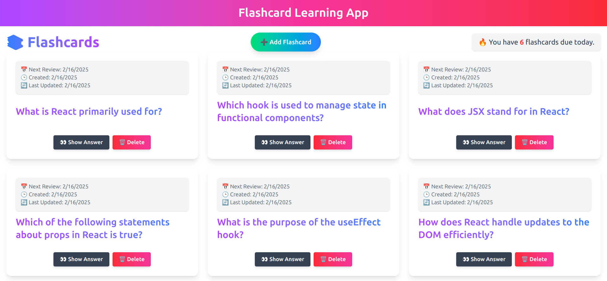
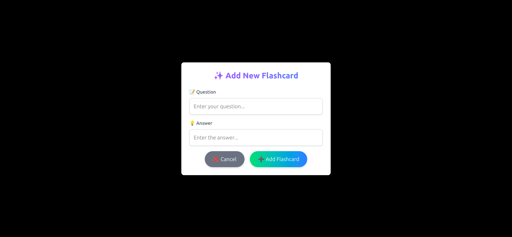
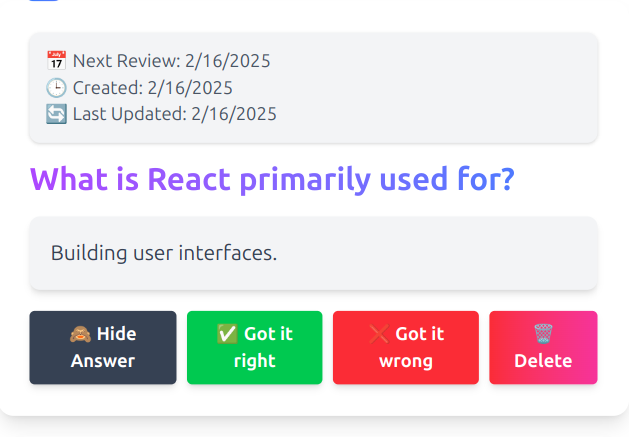

# Flashcard Learning App with Leitner System
## Live Demo
🔗 **Try the application here:** [Flashcard Learning App](https://alfredtask-nh2p.onrender.com/)

## Features
This project is a Flashcard Learning App built using the MERN (MongoDB, Express.js, React, Node.js) stack. It incorporates the **Leitner System**, a spaced repetition technique, to help users efficiently review and memorize flashcards.
### ✅ Backend (Node.js, Express, MongoDB, Mongoose)
- **API Endpoints:**
  - `POST /flashcards` → Add a new flashcard
  - `GET /flashcards` → Get all flashcards
  - `PUT /flashcards/:id` → Update a flashcard (move to the next level if answered correctly)
  - `DELETE /flashcards/:id` → Delete a flashcard
- **Leitner System Logic:**
  - Flashcards start in **Box 1**.
  - If answered correctly, they move to the next box.
  - If answered incorrectly, they return to Box 1.
  - Higher boxes have longer review intervals.
- **Data Storage:** Flashcards include **box level, question, answer, and next review date**, stored in MongoDB.

### ✅ Frontend (React, React Hooks, Axios, Tailwind/Bootstrap)
- Display flashcards with options:
  - "Show Answer" button
  - "Got it right" and "Got it wrong" buttons
- Update flashcard levels based on user responses.
- Fetch flashcards based on their next review date.
- Show progress.
- Clean and simple UI with minimal distractions.
## Tech Stack

### Frontend:
- React.js
- Axios
- Tailwind CSS

### Backend:
- Node.js
- Express.js
- MongoDB (atlas)

## Installation & Setup

### Prerequisites
Ensure you have the following installed:
- Node.js
- MongoDB (MongoDB Atlas)
- Git

### Steps to Run Locally

#### 1. Clone the Repository
```sh
https://github.com/AshishPku/ALFREDTASK.git
cd ALFREDTASK
```

#### 2. Backend Setup
```sh
cd server
npm install
```

#### 3. Set Up Environment Variables
Create a `.env` file in the `server` directory and add:
```env
MONGO_URI=mongodb://localhost:27017
PORT=5000
```

#### 4. Start the Backend Server
```sh
npm run dev
```

#### 5. Frontend Setup
```sh
cd ../client
npm install
```

#### 6. Start the Frontend
```sh
npm run dev
```

<p align="center">
  
  
  
</p>
## Contribution
Pull requests are welcome. Please follow best coding practices and ensure proper testing before submitting changes.
## License
This project is licensed under the MIT License.

